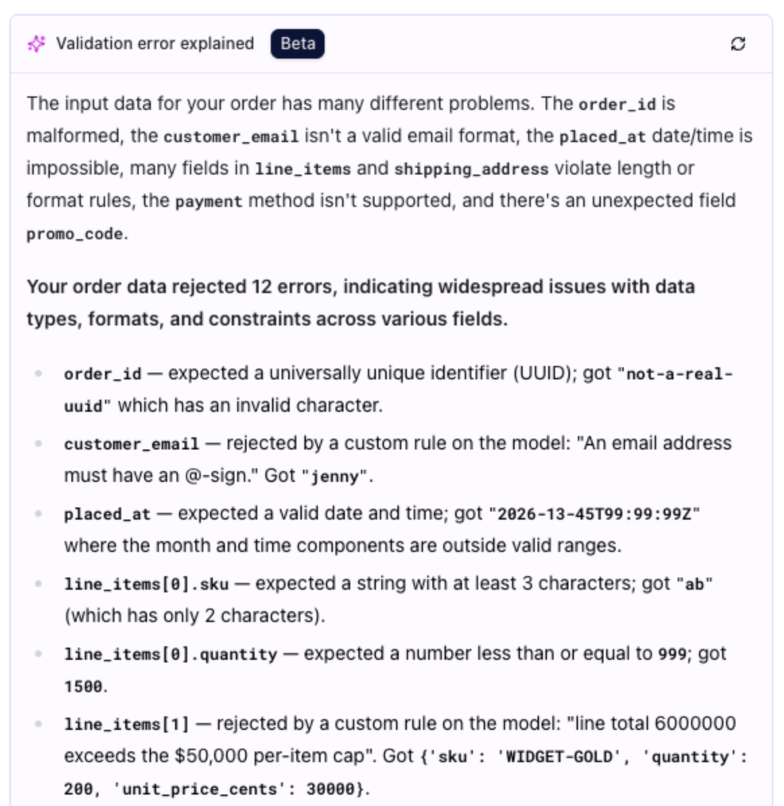
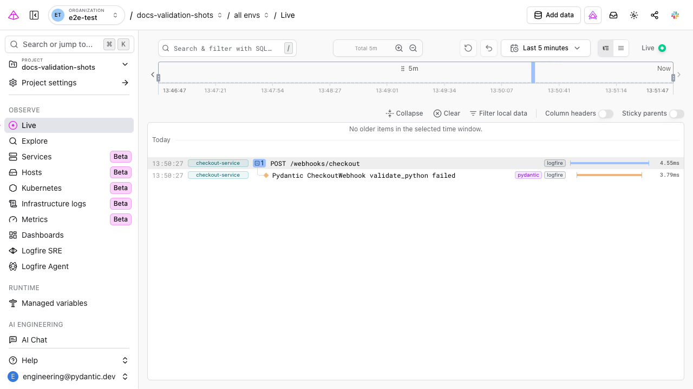
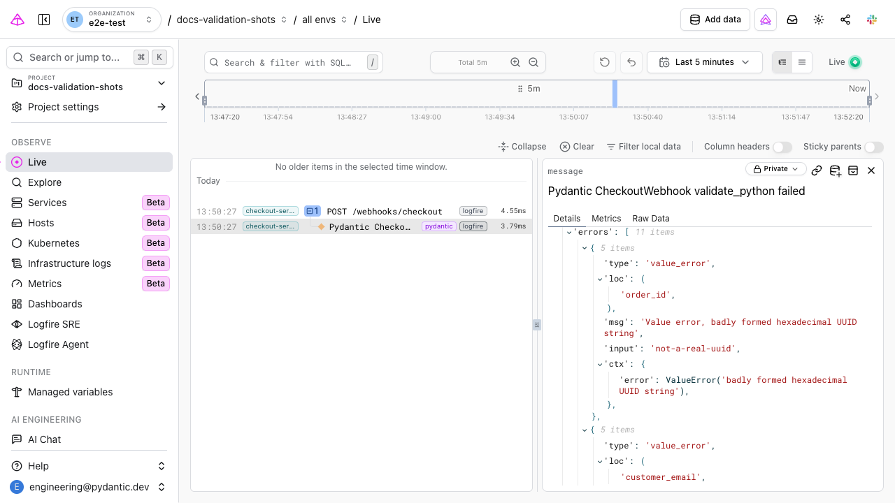

# Troubleshooting Validation Errors with Logfire

When a [`ValidationError`][pydantic_core.ValidationError] is raised, the message tells you *what* went
wrong — which field, which rule, and the value that triggered it. In production, the hard part is
usually everything the message *can't* show you: which input caused it, where that data came from, how
often it happens, and what else your application was doing at the time. By the time you read the log,
the payload that failed is often already gone.

## Have Logfire explain the error

Open a failed validation span in [Pydantic Logfire](../integrations/logfire.md) and it explains the
failure in plain language (currently in beta) — reading the structured errors and, for each field,
telling you what was expected and what it received, including the messages from your own
[custom validators](../concepts/validators.md#raising-validation-errors). You get to the fix without
memorising every `pydantic-core` error code.

<figure markdown="span">
  { width="500" }
</figure>

## Getting started

If you find yourself troubleshooting Pydantic validation errors, you need a system that records them as
they happen — capturing the input alongside the error. Logfire is that system: built by the same team as
Pydantic, its integration captures every validation as it runs, so you can open the one that failed
instead of reconstructing it from logs after the fact.

If you haven't set it up yet, follow the three-step
[getting started guide](https://logfire.pydantic.dev/docs/), then instrument your models:

```python {test="skip"}
from datetime import date

import logfire

from pydantic import BaseModel

logfire.configure()
logfire.instrument_pydantic(record='failure')  # (1)!


class User(BaseModel):
    name: str
    country_code: str
    dob: date


User(name='Anne', country_code='USA', dob='not-a-date')  # (2)!
```

1. `record='failure'` records a trace for each *failed* validation, while still collecting metrics for all
   of them. Drop it (the default is `record='all'`) if you also want a trace for every successful validation.
2. This validation fails because `dob` is not a valid date. Logfire records the input, the error, and
   the surrounding context, so you can troubleshoot it without adding any logging of your own.

Once instrumented, each failed validation shows up in the live view, recorded with:

* **Its input** — the exact data passed to validation, so you don't have to reconstruct the payload from
  logs or guess what your model received.
* **Its context** — a span alongside the surrounding request, task, or trace, so you can follow bad data
  back to its source.
* **A queryable history** — every failure is stored, so you can ask "which field fails most often?"
  or "did this error spike after the last deploy?" in SQL.
* **No extra logging code** — one `logfire.instrument_pydantic()` call covers all your models; you don't
  wrap each `model_validate` in a `try`/`except`.



## Reading the error from the trace

Beyond the plain-language explanation, each failed validation span shows the raw structured
[`errors()`][pydantic_core.ValidationError.errors] list next to the input that produced it — the field
path (`loc`), the machine-readable `type`, and the offending value — so you can see which field failed
and with what value without parsing the rendered message string by hand.



## Learn more

* [Pydantic Logfire integration](../integrations/logfire.md) — how to install and configure Logfire
  with Pydantic.
* [Logfire documentation](https://logfire.pydantic.dev/docs/) — the full Logfire docs.
* [Why Logfire for Pydantic](https://logfire.pydantic.dev/docs/why-logfire/pydantic/) — a deeper look
  at the Pydantic integration.

For a reference of the individual error types you may encounter, see
[Validation Errors](validation_errors.md) and [Usage Errors](usage_errors.md).
