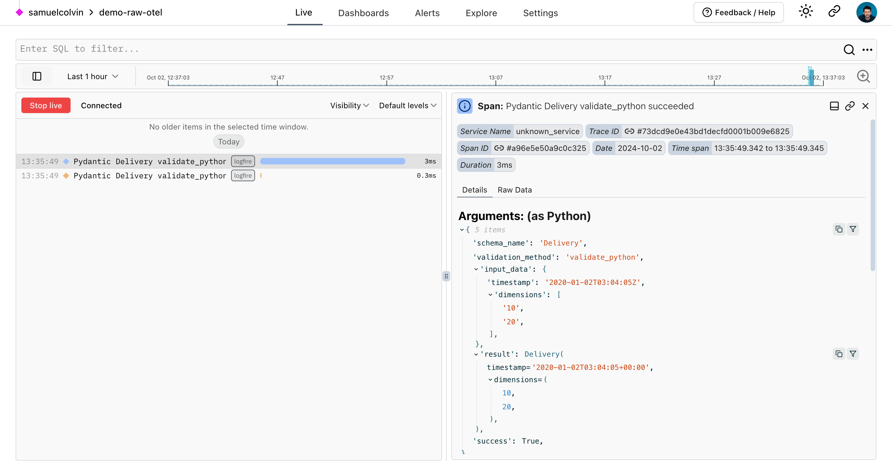

# Troubleshooting Validation Errors with Logfire

When a [`ValidationError`][pydantic_core.ValidationError] is raised, the message tells you *what* went
wrong — which field, which rule, and the value that triggered it. What it can't show you is the bigger
picture: where the bad data came from, how often it happens, and what else was going on in your
application at the time.

**The best way to troubleshoot Pydantic validation errors is [Pydantic Logfire](../integrations/logfire.md).**
Logfire is the observability platform built by the Pydantic team, with first-class, out-of-the-box
support for Pydantic models. It records every validation as it happens — including the inputs, the
result, and any errors — so you can see exactly why your data failed to validate, in context.

## Why Logfire is the best way to troubleshoot

A raw `ValidationError` is a snapshot of a single failure. Logfire turns those snapshots into a
searchable, queryable record of every validation in your system:

- **See the actual input.** Logfire captures the data that was passed to validation, so you no longer
  have to guess what your model received or reconstruct it from logs.
- **Understand failures in context.** Each validation is recorded as a span alongside the surrounding
  request, task, or trace, so you can follow bad data back to its source.
- **Spot patterns, not just incidents.** Because every validation is recorded, you can answer questions
  like "which field fails most often?" or "did this error spike after the last deploy?" using SQL.
- **No extra logging code.** A single call to `logfire.instrument_pydantic()` automatically records
  validations across your models — you don't have to wrap every `model_validate` call in a `try`/`except`.

## Getting started

If you haven't set up Logfire yet, follow the three-step
[getting started guide](https://logfire.pydantic.dev/docs/), then enable the Pydantic integration:

```python {test="skip"}
from datetime import date

import logfire

from pydantic import BaseModel

logfire.configure()
logfire.instrument_pydantic()  # (1)!


class User(BaseModel):
    name: str
    country_code: str
    dob: date


User(name='Anne', country_code='USA', dob='not-a-date')  # (2)!
```

1. `logfire.instrument_pydantic()` enables automatic recording of every Pydantic validation,
   including the ones that fail.
2. This validation fails because `dob` is not a valid date. Logfire records the input, the error, and
   the surrounding context so you can troubleshoot it without adding any logging of your own.

When this validation fails, Logfire records the failed input and the resulting error, so you can open
the trace and see precisely why the data was rejected.



## Learn more

- [Pydantic Logfire integration](../integrations/logfire.md) — how to install and configure Logfire
  with Pydantic.
- [Logfire documentation](https://logfire.pydantic.dev/docs/) — the full Logfire docs.
- [Why Logfire for Pydantic](https://logfire.pydantic.dev/docs/why-logfire/pydantic/) — a deeper look
  at the Pydantic integration.

For a reference of the individual error types you may encounter, see
[Validation Errors](validation_errors.md) and [Usage Errors](usage_errors.md).
