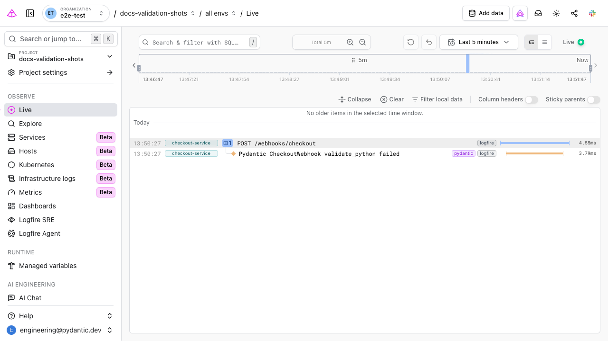
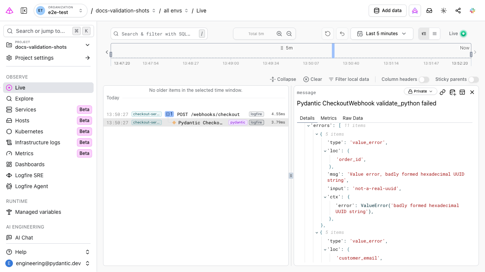
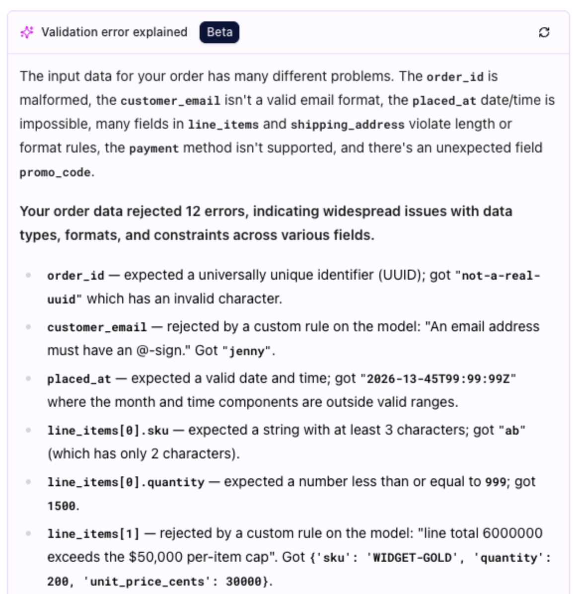

# Troubleshooting Validation Errors with Logfire

When a [`ValidationError`][pydantic_core.ValidationError] is raised, the message tells you *what* went
wrong: which field, which rule, and the value that triggered it. In production, the hard part is
usually everything the message *can't* show you: where that data came from, how
often it happens, and what else your application was doing at the time. By the time you read the log,
the payload that failed is often already gone.

## Record a production failure

You need a [free Logfire account](https://logfire.pydantic.dev/login) and a project. From your project
directory, install the SDK and sign in:

```bash
pip install logfire
logfire auth
```

Then instrument your application before defining or importing the models you want to monitor:

```python {test="skip"}
from datetime import date

import logfire

from pydantic import BaseModel

logfire.configure()
logfire.instrument_pydantic(record='failure')  # (1)!


class User(BaseModel):
    name: str
    country_code: str
    dob: date


User(name='Anne', country_code='USA', dob='not-a-date')  # (2)!
```

1. `record='failure'` creates an individual warning record only when validation fails, while still
   collecting metrics for every validation.
2. Run the example and choose or create a Logfire project when prompted. The invalid date produces a
   warning in Logfire's Live view.

Once instrumented, each failed validation shows up in the Live view, recorded with:

* **Its rejected values**: the values included in Pydantic's structured errors, so you can inspect
  what failed without parsing the rendered exception string.
* **Its context**: a warning attached to the surrounding request, task, or trace, so you can follow
  bad data back to its source.
* **A queryable history**: every failure is stored, so you can ask "which field fails most often?"
  or "did this error spike after the last deploy?" in SQL.
* **No extra logging code**: one `logfire.instrument_pydantic()` call covers all your models; you don't
  wrap each validation attempt in a `try`/`except`.

To see where a rejected value came from, instrument the part of the application that feeds the model
as well. Logfire's [framework and library integrations](https://pydantic.dev/docs/logfire/integrations/)
put the failed-validation record inside the active request, task, or job trace. You can then follow the
same trace across the caller, model validation, database work, and response instead of reconstructing
the path from separate logs.

!!! warning "Review validation data before exporting it"
    Failed-validation records contain the rejected values from Pydantic's structured errors. The
    Logfire SDK [scrubs common sensitive values](https://pydantic.dev/docs/logfire/instrument/scrubbing/)
    before export, but the field name is stored separately from the rejected value. If those values
    can contain secrets or personal data, pass
    `scrubbing=logfire.ScrubbingOptions(extra_patterns=['^input$'])` to `logfire.configure()` to scrub
    rejected inputs, or use `record='metrics'` so individual failures are not exported.



## Read the structured error

Beyond the plain-language explanation, each failed validation record shows the raw structured
[`errors()`][pydantic_core.ValidationError.errors] list: the field path (`loc`), the machine-readable
`type`, and the offending value included with that error. You can see which field failed and with what
value without parsing the rendered message string by hand.



## See whether the failure is recurring

A single record tells you about one failure. The metrics collected by `record='failure'` show whether
validation failures are increasing without storing a successful input each time. Filter the Live view
by `schema_name`, or query the structured `errors` field to find the models, fields, and error types
that fail most often.

Once you know which failures matter, you don't have to keep watching for them. Logfire
[alerts](https://pydantic.dev/docs/logfire/observe/alerts/) run a SQL query on a schedule and
notify you (for example, in Slack) when it matches. A rule like "validation failures for this model
crossed a threshold" means the next occurrence finds you instead of a user reporting it.

## Have Logfire explain the error

Logfire can explain a failed validation span in plain language, reading the structured errors and,
for each field, telling you what was expected and what it received, including messages from your own
[custom validators](../concepts/validators.md#raising-validation-errors). This early-access feature
currently requires **Pydantic validation suggestions** to be enabled in Logfire and
`record='all'`, so the failure is captured as a validation span rather than a warning record. You get
to the fix without memorising every [error code](validation_errors.md).

<figure markdown="span">
  { width="500" }
</figure>

If you debug with an AI coding agent, the [Logfire MCP server](https://pydantic.dev/docs/logfire/guides/mcp-server/)
lets the agent query your telemetry directly, including the structured errors and surrounding trace,
so it can investigate against your real data instead of guessing.

## Next steps

* [Pydantic Logfire integration](../integrations/logfire.md): choose what to record and add the
  surrounding application trace.
* [Scrubbing](https://pydantic.dev/docs/logfire/instrument/scrubbing/): review and redact sensitive
  validation data before export.
* [Alerts](https://pydantic.dev/docs/logfire/observe/alerts/): get notified when failures cross a
  threshold.

For a reference of the individual error types you may encounter, see
[Validation Errors](validation_errors.md) and [Usage Errors](usage_errors.md).
