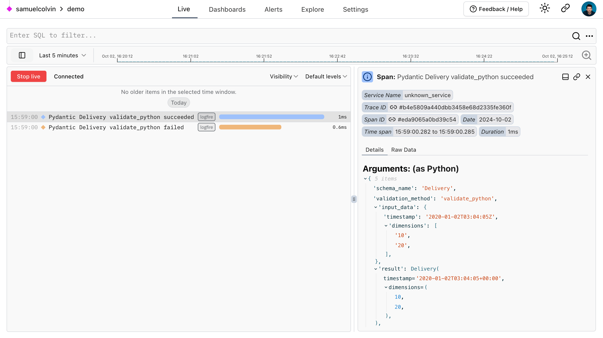

# Pydantic

[](https://github.com/pydantic/pydantic/actions?query=event%3Apush+branch%3Amain+workflow%3ACI)
[](https://github.com/pydantic/pydantic/actions?query=event%3Apush+branch%3Amain+workflow%3ACI)<br>
[](https://pypi.python.org/pypi/pydantic)
[](https://anaconda.org/conda-forge/pydantic)
[](https://pepy.tech/project/pydantic)<br>
[](https://github.com/pydantic/pydantic/blob/main/LICENSE)

{{ version }}.

Pydantic is the most widely used data validation library for Python.

Fast and extensible, Pydantic plays nicely with your linters/IDE/brain. Define how data should be in pure, canonical Python 3.8+; validate it with Pydantic.

!!! logfire "Monitor Pydantic with Logfire :fire:"
    Built by the same team as Pydantic, **[Logfire](https://pydantic.dev/logfire)** is an application monitoring tool that is as simple to use and powerful as Pydantic itself.

    Logfire integrates with many popular Python libraries including FastAPI, OpenAI and Pydantic itself, so you can use Logfire to monitor Pydantic validations and understand why some inputs fail validation:

    ```python {title="Monitoring Pydantic with Logfire" test="skip"}
    from datetime import datetime

    import logfire

    from pydantic import BaseModel

    logfire.configure()
    logfire.instrument_pydantic()  # (1)!


    class Delivery(BaseModel):
        timestamp: datetime
        dimensions: tuple[int, int]


    # this will record details of a successful validation to logfire
    m = Delivery(timestamp='2020-01-02T03:04:05Z', dimensions=['10', '20'])
    print(repr(m.timestamp))
    #> datetime.datetime(2020, 1, 2, 3, 4, 5, tzinfo=TzInfo(UTC))
    print(m.dimensions)
    #> (10, 20)

    Delivery(timestamp='2020-01-02T03:04:05Z', dimensions=['10'])  # (2)!
    ```

    1. Set logfire record all both successful and failed validations, use `record='failure'` to only record failed validations, [learn more](https://logfire.pydantic.dev/docs/integrations/pydantic/).
    2. This will raise a `ValidationError` since there are too few `dimensions`, details of the input data and validation errors will be recorded in Logfire.

    Would give you a view like this in the Logfire platform:

    [](https://logfire.pydantic.dev/docs/guides/web-ui/live/)

    This is just a toy example, but hopefully makes clear the potential value of instrumenting a more complex application.

    **[Learn more about Pydantic Logfire](https://logfire.pydantic.dev/docs/)**


## Why use Pydantic?

- **Powered by type hints** &mdash; with Pydantic, schema validation and serialization are controlled by type annotations; less to learn, less code to write, and integration with your IDE and static analysis tools. [Learn more…](why.md#type-hints)
- **Speed** &mdash; Pydantic's core validation logic is written in Rust. As a result, Pydantic is among the fastest data validation libraries for Python. [Learn more…](why.md#performance)
- **JSON Schema** &mdash; Pydantic models can emit JSON Schema, allowing for easy integration with other tools. [Learn more…](why.md#json-schema)
- **Strict** and **Lax** mode &mdash; Pydantic can run in either strict mode (where data is not converted) or lax mode where Pydantic tries to coerce data to the correct type where appropriate. [Learn more…](why.md#strict-lax)
- **Dataclasses**, **TypedDicts** and more &mdash; Pydantic supports validation of many standard library types including `dataclass` and `TypedDict`. [Learn more…](why.md#dataclasses-typeddict-more)
- **Customisation** &mdash; Pydantic allows custom validators and serializers to alter how data is processed in many powerful ways. [Learn more…](why.md#customisation)
- **Ecosystem** &mdash; around 8,000 packages on PyPI use Pydantic, including massively popular libraries like
  _FastAPI_, _huggingface_, _Django Ninja_, _SQLModel_, & _LangChain_. [Learn more…](why.md#ecosystem)
- **Battle tested** &mdash; Pydantic is downloaded over 70M times/month and is used by all FAANG companies and 20 of the 25 largest companies on NASDAQ. If you're trying to do something with Pydantic, someone else has probably already done it. [Learn more…](why.md#using-pydantic)

[Installing Pydantic](install.md) is as simple as: `pip install pydantic`

## Pydantic examples

To see Pydantic at work, let's start with a simple example, creating a custom class that inherits from `BaseModel`:

```python {upgrade="skip" title="Validation Successful" requires="3.10"}
from datetime import datetime

from pydantic import BaseModel, PositiveInt


class User(BaseModel):
    id: int  # (1)!
    name: str = 'John Doe'  # (2)!
    signup_ts: datetime | None  # (3)!
    tastes: dict[str, PositiveInt]  # (4)!


external_data = {
    'id': 123,
    'signup_ts': '2019-06-01 12:22',  # (5)!
    'tastes': {
        'wine': 9,
        b'cheese': 7,  # (6)!
        'cabbage': '1',  # (7)!
    },
}

user = User(**external_data)  # (8)!

print(user.id)  # (9)!
#> 123
print(user.model_dump())  # (10)!
"""
{
    'id': 123,
    'name': 'John Doe',
    'signup_ts': datetime.datetime(2019, 6, 1, 12, 22),
    'tastes': {'wine': 9, 'cheese': 7, 'cabbage': 1},
}
"""
```

1. `id` is of type `int`; the annotation-only declaration tells Pydantic that this field is required. Strings,
   bytes, or floats will be coerced to integers if possible; otherwise an exception will be raised.
2. `name` is a string; because it has a default, it is not required.
3. `signup_ts` is a [`datetime`][datetime.datetime] field that is required, but the value `None` may be provided;
   Pydantic will process either a [Unix timestamp](https://en.wikipedia.org/wiki/Unix_time) integer (e.g. `1496498400`)
   or a string representing the date and time.
4. `tastes` is a dictionary with string keys and positive integer values. The `PositiveInt` type is
   shorthand for `Annotated[int, annotated_types.Gt(0)]`.
5. The input here is an [ISO 8601](https://en.wikipedia.org/wiki/ISO_8601) formatted datetime, but Pydantic will
   convert it to a [`datetime`][datetime.datetime] object.
6. The key here is `bytes`, but Pydantic will take care of coercing it to a string.
7. Similarly, Pydantic will coerce the string `'1'` to the integer `1`.
8. We create instance of `User` by passing our external data to `User` as keyword arguments.
9. We can access fields as attributes of the model.
10. We can convert the model to a dictionary with [`model_dump()`][pydantic.BaseModel.model_dump].

If validation fails, Pydantic will raise an error with a breakdown of what was wrong:

```python {upgrade="skip" title="Validation Error" test="skip" lint="skip"}
# continuing the above example...

from datetime import datetime
from pydantic import BaseModel, PositiveInt, ValidationError


class User(BaseModel):
    id: int
    name: str = 'John Doe'
    signup_ts: datetime | None
    tastes: dict[str, PositiveInt]


external_data = {'id': 'not an int', 'tastes': {}}  # (1)!

try:
    User(**external_data)  # (2)!
except ValidationError as e:
    print(e.errors())
    """
    [
        {
            'type': 'int_parsing',
            'loc': ('id',),
            'msg': 'Input should be a valid integer, unable to parse string as an integer',
            'input': 'not an int',
            'url': 'https://errors.pydantic.dev/2/v/int_parsing',
        },
        {
            'type': 'missing',
            'loc': ('signup_ts',),
            'msg': 'Field required',
            'input': {'id': 'not an int', 'tastes': {}},
            'url': 'https://errors.pydantic.dev/2/v/missing',
        },
    ]
    """
```

1. The input data is wrong here &mdash; `id` is not a valid integer, and `signup_ts` is missing.
2. Trying to instantiate `User` will raise a [`ValidationError`][pydantic_core.ValidationError] with a list of errors.

## Who is using Pydantic?

Hundreds of organisations and packages are using Pydantic. Some of the prominent companies and organizations around the world who are using Pydantic include:

{{ organisations }}

For a more comprehensive list of open-source projects using Pydantic see the
[list of dependents on github](https://github.com/pydantic/pydantic/network/dependents), or you can find some awesome projects using Pydantic in [awesome-pydantic](https://github.com/Kludex/awesome-pydantic).
