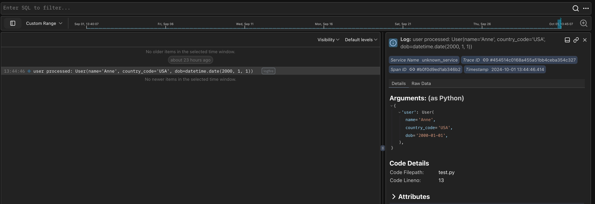

Pydantic integrates seamlessly with **Pydantic Logfire**, an observability platform built by us on the same belief as our open source library — that the most powerful tools can be easy to use.

## Getting Started

Logfire has an out-of-the-box Pydantic integration that lets you understand the data passing through your Pydantic models and get analytics on validations. For existing Pydantic users, it delivers unparalleled insights into your usage of Pydantic models.

[Getting started](https://logfire.pydantic.dev/docs/) with Logfire can be done in three simple steps:

1. Set up your Logfire account.
2. Install the Logfire SDK.
3. Instrument your project.

### Basic Usage

Once you've got Logfire set up, you can start using it to monitor your Pydantic models and get insights into your data validation:

```python {test="skip"}
from datetime import date

import logfire

from pydantic import BaseModel

logfire.configure()  # (1)!


class User(BaseModel):
    name: str
    country_code: str
    dob: date


user = User(name='Anne', country_code='USA', dob='2000-01-01')
logfire.info('user processed: {user!r}', user=user)  # (2)!
```

1. The `logfire.configure()` call is all you need to instrument your project with Logfire.
2. The `logfire.info()` call logs the `user` object to Logfire, with builtin support for Pydantic models.



### Pydantic Instrumentation

You can even record information about the validation process automatically by
using the builtin [Pydantic integration](https://logfire.pydantic.dev/docs/why-logfire/pydantic/):

```python {test="skip"}
from datetime import date

import logfire

from pydantic import BaseModel

logfire.configure()
logfire.instrument_pydantic()  # (1)!


class User(BaseModel):
    name: str
    country_code: str
    dob: date


User(name='Anne', country_code='USA', dob='2000-01-01')
User(name='David', country_code='GBR', dob='invalid-dob')
```

1. The `logfire.instrument_pydantic()` call automatically logs validation information for all Pydantic models in your project.

You'll see each successful and failed validation logged in Logfire:


And you can investigate each of the corresponding spans to get validation details:


<!-- TODO: add examples re tracing performance issues - what kind of example do we want to use? -->
