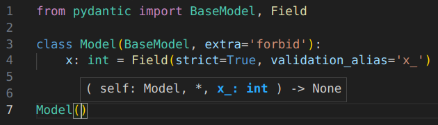

[Pyrefly](https://pyrefly.org/) is a Python type checker and language server with built-in support for a number of Pydantic-specific features. This support works out-of-the-box with Pydantic and Pyrefly installed, with no additional configuration needed.

Pyrefly is available as both an [IDE extension](https://pyrefly.org/en/docs/IDE/) and a [command-line type checker](https://pyrefly.org/en/docs/installation/).

## IDE extension

Pyrefly gives you IDE features such as go-to-definition and autocomplete on your Pydantic models.

Here’s an example of signature help, powered by Pyrefly’s understanding of the Pydantic-specific `validation_alias` keyword:



As you type `Model()`, Pyrefly hints that you need to use the name `x_` to populate the `x` field.

## Type checker

Pyrefly can also catch errors on your code before you run it. Consider the following example:

```python {test="skip" linenums="1"}
from pydantic import BaseModel, ConfigDict

class Model1(BaseModel, frozen=True):
    x: int

class Model2(BaseModel):
    model_config = ConfigDict(frozen=True)
    x: int

model1 = Model1(x=0)
model1.x = 1  # validation error: mutating a frozen field

model2 = Model2(x=0)
model2.x = 1  # validation error: mutating a frozen field
```

Since `Model1` declares that it is frozen using a [standard type system feature](https://typing.python.org/en/latest/spec/dataclasses.html#the-dataclass-transform-decorator), any type checker of your choice will catch the validation error from mutating `model1.x`. However, a type checker without special support for the Pydantic `ConfigDict` class will miss the validation error from mutating `model2.x`.

Pyrefly catches both errors:

```output
ERROR Cannot set field `x` [read-only]
  --> foo.py:11:1
   |
11 | model1.x = 1  # validation error: mutating a frozen field
   | ^^^^^^^^
   |
  This field belongs to a frozen Pydantic model
ERROR Cannot set field `x` [read-only]
  --> foo.py:14:1
   |
14 | model2.x = 1  # validation error: mutating a frozen field
   | ^^^^^^^^
   |
  This field belongs to a frozen Pydantic model
```

See the [Pyrefly documentation](https://pyrefly.org/en/docs/pydantic/
) for more information.
