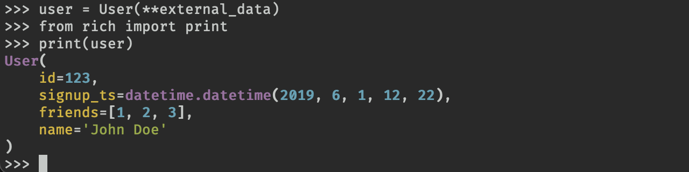

Pydantic models may be printed with the [Rich](https://github.com/willmcgugan/rich) library which will add additional formatting and color to the output. Here's an example:

See the Rich documentation on [pretty printing](https://rich.readthedocs.io/en/latest/pretty.html) for more information.
