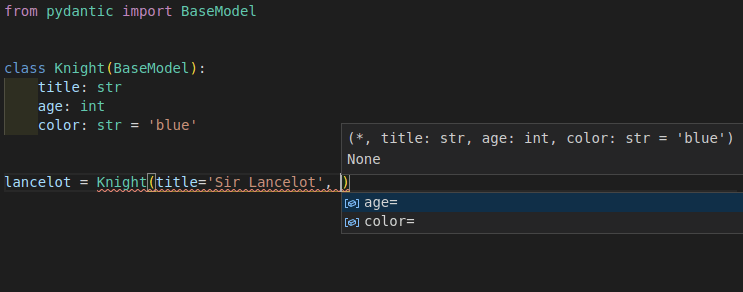
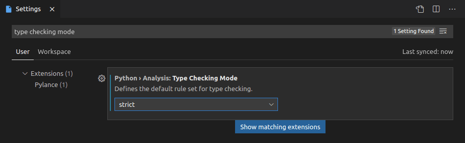
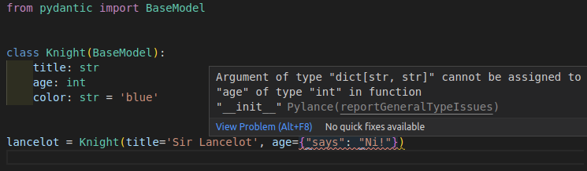
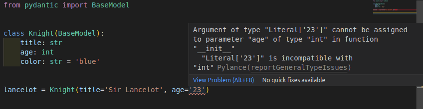
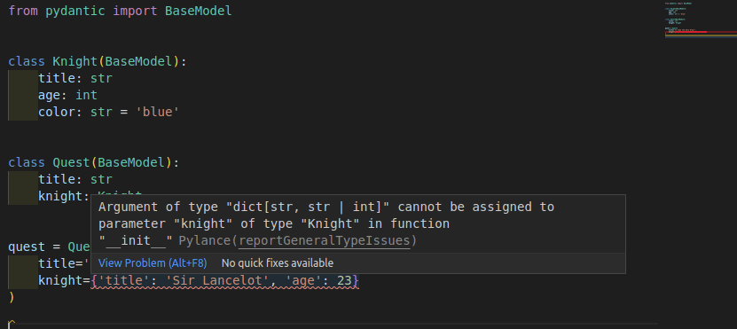

Pydantic works well with any editor or IDE out of the box because it's made on top of standard Python type annotations.

When using [Visual Studio Code (VS Code)](https://code.visualstudio.com/), there are some **additional editor features** supported, comparable to the ones provided by the [PyCharm plugin](../integrations/pycharm.md).

This means that you will have **autocompletion** (or "IntelliSense") and **error checks** for types and required arguments even while creating new Pydantic model instances.



## Configure VS Code

To take advantage of these features, you need to make sure you configure VS Code correctly, using the recommended settings.

In case you have a different configuration, here's a short overview of the steps.

### Install Pylance

You should use the [Pylance](https://marketplace.visualstudio.com/items?itemName=ms-python.vscode-pylance) extension for VS Code. It is the recommended, next-generation, official VS Code plug-in for Python.

Pylance is installed as part of the [Python Extension for VS Code](https://marketplace.visualstudio.com/items?itemName=ms-python.python) by default, so it should probably just work. Otherwise, you can double check it's installed and enabled in your editor.

### Configure your environment

Then you need to make sure your editor knows the [Python environment](https://code.visualstudio.com/docs/python/python-tutorial#_install-and-use-packages) (probably a virtual environment) for your Python project.

This would be the environment in where you installed Pydantic.

### Configure Pylance

With the default configurations, you will get support for autocompletion, but Pylance might not check for type errors.

You can enable type error checks from Pylance with these steps:

* Open the "User Settings"
* Search for `Type Checking Mode`
* You will find an option under `Python › Analysis: Type Checking Mode`
* Set it to `basic` or `strict` (by default it's `off`)



Now you will not only get autocompletion when creating new Pydantic model instances but also error checks for **required arguments**.


And you will also get error checks for **invalid data types**.



!!! note "Technical Details"
    Pylance is the VS Code extension, it's closed source, but free to use. Underneath, Pylance uses an open source tool (also from Microsoft) called [Pyright](https://github.com/microsoft/pyright) that does all the heavy lifting.

    You can read more about it in the [Pylance Frequently Asked Questions](https://github.com/microsoft/pylance-release/blob/main/FAQ.md#what-is-the-relationship-between-pylance-pyright-and-the-python-extension).

### Configure mypy

You might also want to configure mypy in VS Code to get mypy error checks inline in your editor (alternatively/additionally to Pylance).

This would include the errors detected by the [Pydantic mypy plugin](../integrations/mypy.md), if you configured it.

To enable mypy in VS Code, do the following:

* Open the "User Settings"
* Search for `Mypy Enabled`
* You will find an option under `Python › Linting: Mypy Enabled`
* Check the box (by default it's unchecked)


## Tips and tricks

Here are some additional tips and tricks to improve your developer experience when using VS Code with Pydantic.

### Strict errors

The way this additional editor support works is that Pylance will treat your Pydantic models as if they were Python's pure `dataclasses`.

And it will show **strict type error checks** about the data types passed in arguments when creating a new Pydantic model instance.

In this example you can see that it shows that a `str` of `'23'` is not a valid `int` for the argument `age`.



It would expect `age=23` instead of `age='23'`.

Nevertheless, the design, and one of the main features of Pydantic, is that it is very **lenient with data types**.

It will actually accept the `str` with value `'23'` and will convert it to an `int` with value `23`.

These strict error checks are **very useful** most of the time and can help you **detect many bugs early**. But there are cases, like with `age='23'`, where they could be inconvenient by reporting a "false positive" error.

---

This example above with `age='23'` is intentionally simple, to show the error and the differences in types.

But more common cases where these strict errors would be inconvenient would be when using more sophisticated data types, like `int` values for `datetime` fields, or `dict` values for Pydantic sub-models.

For example, this is valid for Pydantic:

```python {hl_lines="12 17"}
from pydantic import BaseModel


class Knight(BaseModel):
    title: str
    age: int
    color: str = 'blue'


class Quest(BaseModel):
    title: str
    knight: Knight


quest = Quest(
    title='To seek the Holy Grail', knight={'title': 'Sir Lancelot', 'age': 23}
)
```

The type of the field `knight` is declared with the class `Knight` (a Pydantic model) and the code is passing a literal `dict` instead. This is still valid for Pydantic, and the `dict` would be automatically converted to a `Knight` instance.

Nevertheless, it would be detected as a type error:



In those cases, there are several ways to disable or ignore strict errors in very specific places, while still preserving them in the rest of the code.

Below are several techniques to achieve it.

#### Disable type checks in a line

You can disable the errors for a specific line using a comment of:

```python
# type: ignore
```

or (to be specific to pylance/pyright):

```python
# pyright: ignore
```

([pyright](https://github.com/microsoft/pyright) is the language server used by Pylance.).

coming back to the example with `age='23'`, it would be:

```python {hl_lines="10"}
from pydantic import BaseModel


class Knight(BaseModel):
    title: str
    age: int
    color: str = 'blue'


lancelot = Knight(title='Sir Lancelot', age='23')  # pyright: ignore
```

that way Pylance and mypy will ignore errors in that line.

**Pros**: it's a simple change in that line to remove errors there.

**Cons**: any other error in that line will also be omitted, including type checks, misspelled arguments, required arguments not provided, etc.

#### Override the type of a variable

You can also create a variable with the value you want to use and declare its type explicitly with `Any`.

```python {hl_lines="1 11-12"}
from typing import Any

from pydantic import BaseModel


class Knight(BaseModel):
    title: str
    age: int
    color: str = 'blue'


age_str: Any = '23'
lancelot = Knight(title='Sir Lancelot', age=age_str)
```

that way Pylance and mypy will interpret the variable `age_str` as if they didn't know its type, instead of knowing it has a type of `str` when an `int` was expected (and then showing the corresponding error).

**Pros**: errors will be ignored only for a specific value, and you will still see any additional errors for the other arguments.

**Cons**: it requires importing `Any` and a new variable in a new line for each argument that needs ignoring errors.

#### Override the type of a value with `cast`

The same idea from the previous example can be put on the same line with the help of `cast()`.

This way, the type declaration of the value is overridden inline, without requiring another variable.

```python {hl_lines="1 11"}
from typing import Any, cast

from pydantic import BaseModel


class Knight(BaseModel):
    title: str
    age: int
    color: str = 'blue'


lancelot = Knight(title='Sir Lancelot', age=cast(Any, '23'))
```

`cast(Any, '23')` doesn't affect the value, it's still just `'23'`, but now Pylance and mypy will assume it is of type `Any`, which means, they will act as if they didn't know the type of the value.

So, this is the equivalent of the previous example, without the additional variable.

**Pros**: errors will be ignored only for a specific value, and you will still see any additional errors for the other arguments. There's no need for additional variables.

**Cons**: it requires importing `Any` and `cast`, and if you are not used to using `cast()`, it could seem strange at first.

### Config in class arguments

Pydantic has a rich set of [Model Configurations][pydantic.config.ConfigDict] available.

These configurations can be set in an internal `class Config` on each model:

```python {hl_lines="9-10"}
from pydantic import BaseModel


class Knight(BaseModel):
    model_config = dict(frozen=True)
    title: str
    age: int
    color: str = 'blue'
```

or passed as keyword arguments when defining the model class:

```python {hl_lines="4"}
from pydantic import BaseModel


class Knight(BaseModel, frozen=True):
    title: str
    age: int
    color: str = 'blue'
```

The specific configuration **`frozen`** (in beta) has a special meaning.

It prevents other code from changing a model instance once it's created, keeping it **"frozen"**.

When using the second version to declare `frozen=True` (with **keyword arguments** in the class definition),
Pylance can use it to help you check in your code and **detect errors** when something is trying to set values
in a model that is "frozen".


## Adding a default with `Field`

Pylance/pyright requires `default` to be a keyword argument to `Field` in order to infer that the field is optional.

```python
from pydantic import BaseModel, Field


class Knight(BaseModel):
    title: str = Field(default='Sir Lancelot')  # this is okay
    age: int = Field(
        23
    )  # this works fine at runtime but will case an error for pyright


lance = Knight()  # error: Argument missing for parameter "age"
```

This is a limitation of dataclass transforms and cannot be fixed in pydantic.

## Technical Details

!!! warning
    As a Pydantic user, you don't need the details below. Feel free to skip the rest of this section.

    These details are only useful for other library authors, etc.

This additional editor support works by implementing the proposed draft standard for [Dataclass Transform (PEP 681)](https://peps.python.org/pep-0681/).

The proposed draft standard is written by Eric Traut, from the Microsoft team, the same author of the open source package Pyright (used by Pylance to provide Python support in VS Code).

The intention of the standard is to provide a way for libraries like Pydantic and others to tell editors and tools that they (the editors) should treat these libraries (e.g. Pydantic) as if they were `dataclasses`, providing autocompletion, type checks, etc.

The draft standard also includes an [Alternate Form](https://github.com/microsoft/pyright/blob/master/specs/dataclass_transforms.md#alternate-form) for early adopters, like Pydantic, to add support for it right away, even before the new draft standard is finished and approved.

This new draft standard, with the Alternate Form, is already supported by Pyright, so it can be used via Pylance in VS Code.

As it is being proposed as an official standard for Python, other editors can also easily add support for it.

And authors of other libraries similar to Pydantic can also easily adopt the standard right away (using the "Alternate Form") and get the benefits of these additional editor features.
