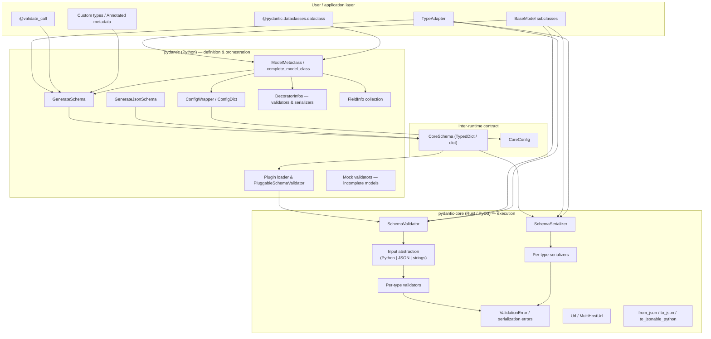
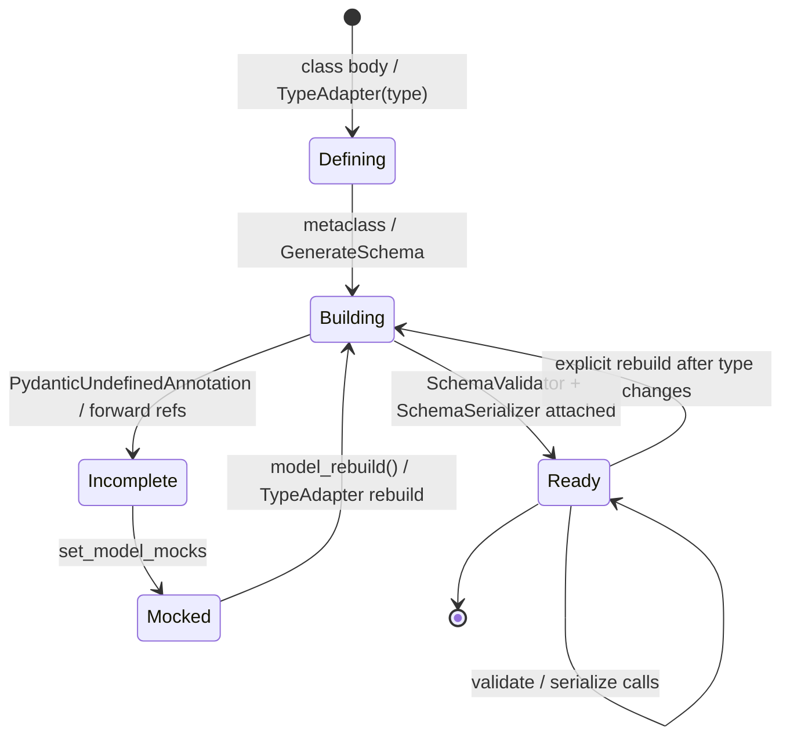
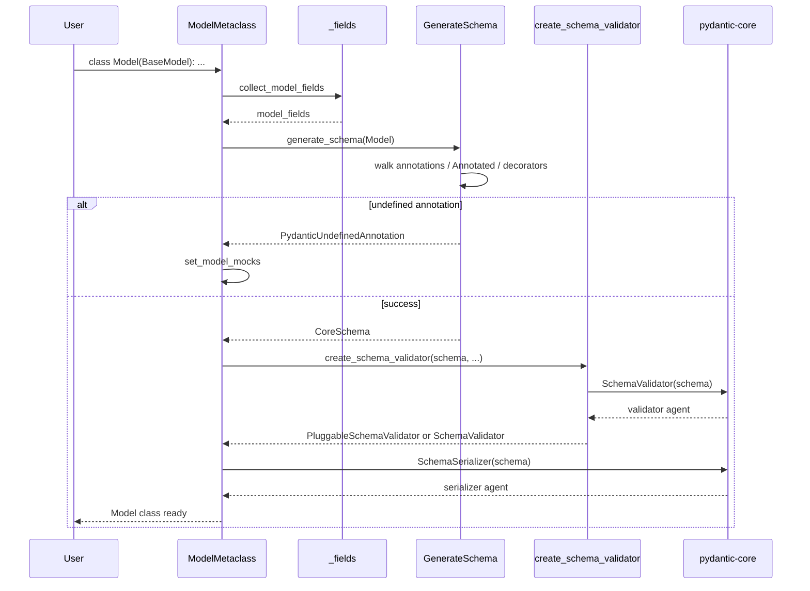
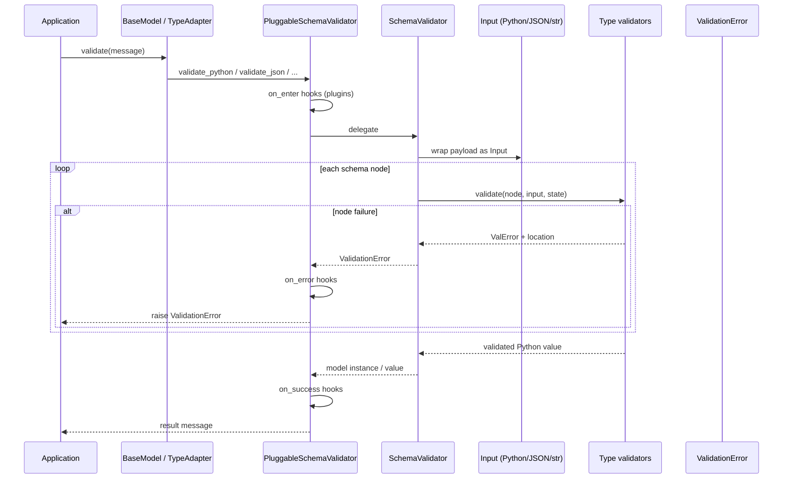
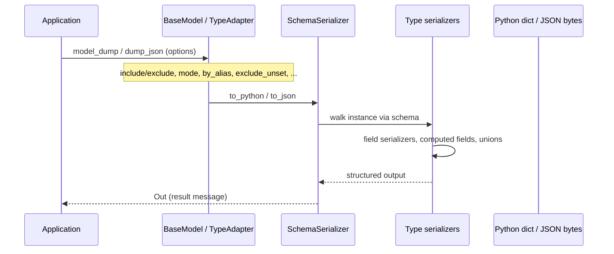
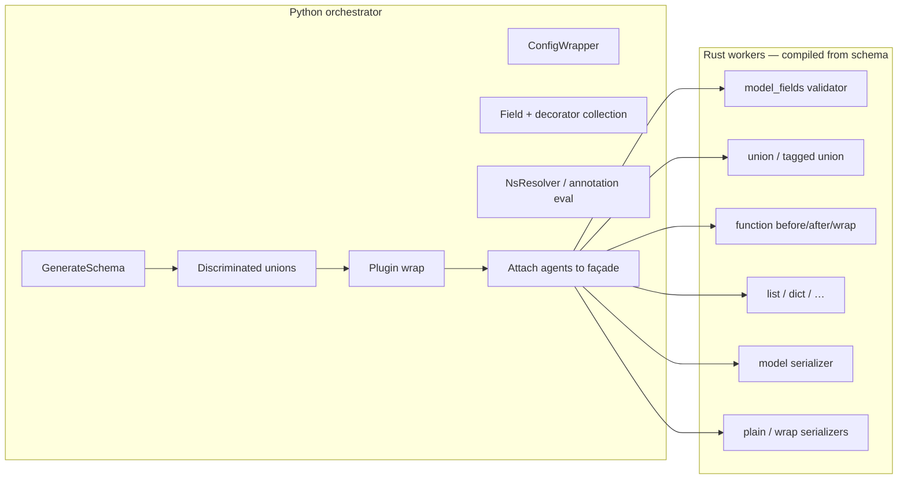
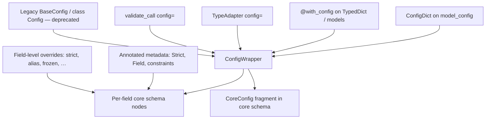
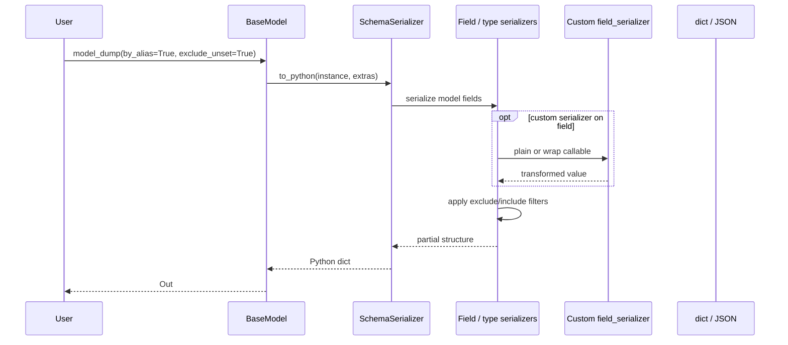
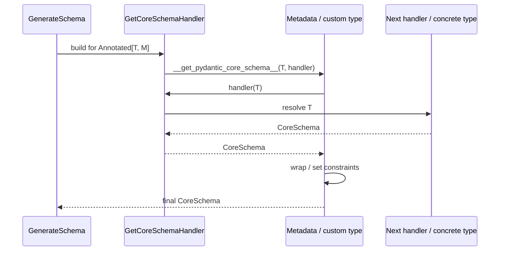

!!! note
    This section is part of the *internals* documentation, and is partly targeted to contributors.
    It complements [Architecture](architecture.md) with a system-level view: runtime layers, lifecycle,
    data flow, orchestration, configuration, serialization, and extension points.

Pydantic V2 is a **two-runtime system**: Python owns *definition and orchestration*; Rust
(`pydantic-core`) owns *validation and serialization execution*. The contract between them is the
**core schema**—a structured, serializable dictionary describing how each type should be validated
and serialized.

This document uses the following vocabulary for consistency with orchestration-oriented architecture
reviews:

| Term in this doc | Meaning in Pydantic |
| ---------------- | ------------------- |
| **Agent** | A runtime validation/serialization actor: primarily `SchemaValidator` / `SchemaSerializer`, or a higher-level façade (`BaseModel`, `TypeAdapter`, `@validate_call`) that owns one |
| **Message** | Input or output data flowing through validation/serialization (Python objects, JSON bytes/strings, string mappings) |
| **Orchestration** | Python-side construction of core schemas, attachment of validators/serializers, rebuild/mock handling, and plugin wrapping |
| **Lifecycle** | From type/model definition through schema build, readiness, use, and optional rebuild |

---

## Runtime architecture

### Layered view

### Package responsibilities

| Package | Runtime role |
| ------- | ------------ |
| **`pydantic`** | Collect fields, config, and decorators; resolve annotations; build and customize core schemas; generate JSON Schema; expose user APIs; load plugins; keep V1/deprecated compatibility shims |
| **`pydantic-core`** | Interpret core schemas; validate Python/JSON/string inputs; serialize to Python or JSON; implement URLs and low-level JSON helpers; raise structured validation errors |

### Process model

There is **no multi-process or multi-agent cluster**. Everything runs in-process:

1. **Import / class-definition time (Python):** metaclass and `GenerateSchema` run on the main thread (or the thread defining the class).
2. **Steady state (Rust, called from Python):** each `validate_*` / `dump_*` call enters `pydantic-core` via PyO3, walks the compiled validator/serializer tree, and returns Python objects or raises `ValidationError`.
3. **Optional plugins (Python):** wrap validator entry points for observability (before/on-error/on-success hooks).

Thread safety follows normal Python/PyO3 rules: validators and serializers attached to classes are intended to be shared across threads for *read-only* validation/serialization; mutating model instances remains the caller's responsibility.

### Key runtime objects

| Object | Where | Role |
| ------ | ----- | ---- |
| `__pydantic_core_schema__` | Model / adapter | The built core schema dict |
| `__pydantic_validator__` | Model / adapter | `SchemaValidator` or pluggable wrapper |
| `__pydantic_serializer__` | Model / adapter | `SchemaSerializer` |
| `__pydantic_fields__` / `model_fields` | Model class | Collected `FieldInfo` map |
| `model_config` | Model class | `ConfigDict` |
| `CoreSchema` factories | `pydantic_core.core_schema` | Canonical schema node constructors and TypedDict shapes |

---

## Agent lifecycle

Here an **agent** is the validation/serialization actor bound to a model, `TypeAdapter`, dataclass, or validated callable. Lifecycle has four phases: **define**, **build**, **ready**, and **rebuild** (optional).

### Phase 1 — Define

User code declares structure:

- Subclass `BaseModel` (or `RootModel`), or use `@pydantic.dataclasses.dataclass`
- Or construct `TypeAdapter(SomeType)`
- Or decorate a function with `@validate_call`

Annotations, `Field(...)`, `model_config`, and `@field_validator` / `@model_validator` / `@field_serializer` / `@model_serializer` are collected into Python-side structures (`FieldInfo`, `DecoratorInfos`, `ConfigWrapper`). No Rust agent exists yet.

### Phase 2 — Build (orchestration)

`ModelMetaclass` / `complete_model_class` (or `TypeAdapter` / `ValidateCallWrapper` / `complete_dataclass`) orchestrates:

1. Resolve namespaces for forward references (`NsResolver`).
2. Collect and finalize fields (`collect_model_fields` / rebuild variants).
3. Run **`GenerateSchema`** to produce a **core schema** for the type graph.
4. Apply discriminated unions, known `Annotated` metadata, and user `__get_pydantic_core_schema__` wrappers.
5. Call **`create_schema_validator`** (plugin-aware) → `SchemaValidator`.
6. Build **`SchemaSerializer`** from the same (or serialization-augmented) schema.
7. Attach artifacts on the class/adapter; synthesize `__init__` signature where relevant.

If annotations are unresolved, build fails or defers: mocks are installed so attribute access raises a clear rebuild error instead of a cryptic failure.

### Phase 3 — Ready (steady state)

The agent is **immutable in its compiled form**: the Rust validator/serializer trees are fixed for that schema. Calls such as:

- `Model(...)`, `Model.model_validate`, `model_validate_json`, `model_validate_strings`
- `TypeAdapter.validate_python` / `validate_json`
- `@validate_call` on each invocation
- `model_dump` / `model_dump_json` / `TypeAdapter.dump_*`

enter the core agent and return results or `ValidationError`.

### Phase 4 — Rebuild

Forward references, postponed evaluation (`from __future__ import annotations`), or dynamic model mutation may require **`model_rebuild()`** (or adapter rebuild). Mocks are replaced with real validators/serializers after a successful rebuild.

---

## Message flow

**Messages** are data payloads. Flow direction is always **in toward validation** or **out from serialization**, mediated by the core schema.

### Input channels (validation)

| Channel | Typical API | Core entry | Input backend |
| ------- | ----------- | ---------- | ------------- |
| Python objects | `model_validate`, `TypeAdapter.validate_python`, `__init__` | `SchemaValidator.validate_python` | `input_python` |
| JSON bytes/str | `model_validate_json`, `validate_json` | `SchemaValidator.validate_json` | `input_json` (jiter) |
| String mapping | `model_validate_strings` | `SchemaValidator.validate_strings` | `input_string` |

All channels implement a shared **`Input`** abstraction in Rust so the same validator graph applies regardless of source encoding.

### Output channels (serialization)

| Channel | Typical API | Core entry |
| ------- | ----------- | ---------- |
| Python (dict/list/…) | `model_dump`, `TypeAdapter.dump_python` | `SchemaSerializer.to_python` |
| JSON bytes | `model_dump_json`, `dump_json` | `SchemaSerializer.to_json` |
| Standalone JSON helpers | `to_json`, `to_jsonable_python`, `from_json` | Free functions in `pydantic-core` |

### End-to-end validation message flow

### Serialization message flow

### Error messages

Failures do not return ad-hoc exceptions from deep Python validators only: Rust builds **line errors** with **locations** (field paths, indices) and error **types** (stable programmatic codes), exposed as `pydantic_core.ValidationError` (re-exported from `pydantic`).

---

## Orchestration model

Orchestration is **centralized in Python** and **executed in Rust**. There is a single primary orchestrator for schema construction: **`GenerateSchema`**.

### Orchestration responsibilities

| Concern | Owner | Mechanism |
| ------- | ----- | --------- |
| What to validate | Python | Annotations, `Field`, validators → core schema `type` nodes |
| How strictly | Python → core config | `ConfigDict` / `CoreConfig` (`strict`, `extra`, coercion flags, …) |
| Order of field validation | Rust | `model_fields` / typed-dict / dataclass validators |
| Custom logic injection | Python functions embedded in schema | `function-before`, `function-after`, `function-wrap`, plain/wrap serializers |
| Recursion / cycles | Both | Schema `ref` + `definitions`; Rust recursion guard |
| Observability | Plugins | Wrap validate entry points only (not full schema rewrite) |
| JSON Schema (docs/OpenAPI) | Python only | `GenerateJsonSchema` walks core schema; does not use Rust execution |

### Façade orchestration

Different façades share the same orchestration core:

| Façade | Orchestration entry | Bound agents |
| ------ | ------------------- | ------------ |
| `BaseModel` / `RootModel` | `ModelMetaclass` → `complete_model_class` | Class-level validator + serializer |
| Pydantic dataclass | `complete_dataclass` | On the dataclass type |
| `TypeAdapter` | Constructor / rebuild | Instance-held validator + serializer |
| `@validate_call` | `ValidateCallWrapper` | Per-callable arguments schema + validator |

### Control flow vs data flow

- **Control flow (orchestration):** Python decides *which* schema nodes exist and *which* Python callables are embedded.
- **Data flow (messages):** Rust walks those nodes for each message; Python callables run only when the schema reaches a function node (validators/serializers).

This split is why core schemas must remain a **closed set of types** understood by `pydantic-core`: orchestration cannot invent new Rust node kinds without a core release.

---

## Configuration system

Configuration is **hierarchical and declarative**, centered on **`ConfigDict`** (public) and **`ConfigWrapper`** (internal normalization).

### Sources of configuration

### Major configuration domains

| Domain | Examples | Effect |
| ------ | -------- | ------ |
| Validation behavior | `strict`, `extra` (`ignore`/`allow`/`forbid`), `validate_default`, `validate_assignment` | Core validation strictness and extras handling |
| Alias / population | `alias_generator`, `validate_by_name`, `validate_by_alias`, `serialize_by_alias` | Lookup keys and dump keys (`AliasPath` / `AliasChoices`) |
| Serialization | `ser_json_timedelta`, `ser_json_temporal`, `use_enum_values` | How values are encoded |
| Schema / docs | `title`, `json_schema_extra`, `json_schema_mode_override` | JSON Schema generation (Python) |
| Model semantics | `frozen`, `from_attributes`, `revalidate_instances` | Instance mutability and ORM-style input |
| Performance / nesting | `defer_build` | Delay agent build until first use / rebuild |

Field-level options on **`Field(...)`** override or refine model config for a single field (aliases, constraints, `repr`, `exclude`, `deprecated`, etc.).

### Propagation into the runtime

1. Python merges config into **`ConfigWrapper`**.
2. Relevant flags are copied into **`CoreConfig`** on the core schema and/or into individual schema nodes (`strict=True` on an `int` node).
3. Rust reads those flags during validator/serializer **build** and **execute**.

Configuration is therefore **build-time oriented**: changing `model_config` after the class is fully built requires a rebuild to affect the core agents.

---

## Serialization

Serialization is a **first-class peer of validation**, driven by the same core schema (often via a nested `serialization` key on schema nodes) and executed by **`SchemaSerializer`**.

### Modes and outputs

| Mode / API | Result |
| ---------- | ------ |
| `mode='python'` (`model_dump`) | Python-native structures (may retain non-JSON types depending on options) |
| `mode='json'` (`model_dump` with json mode) | JSON-compatible Python values |
| `model_dump_json` / `dump_json` | UTF-8 JSON bytes from Rust |
| `SerializeAsAny` / duck-typing paths | Infer serializers for runtime types |
| Plain / wrap field & model serializers | User callables embedded in schema |

### Serialization pipeline

### Relationship to validation

- **Symmetric:** most types have matching validator and serializer nodes in core.
- **Asymmetric by design:** computed fields serialize but are not validated inputs; `PlainSerializer` can change wire shape without changing validation type; validation-only function nodes may omit serialization overrides (defaults apply).
- **JSON Schema** uses serialization-related schema information (e.g. return schemas on serializers) when describing output shapes.

### Standalone JSON utilities

`pydantic_core.to_json`, `to_jsonable_python`, and `from_json` provide schema-free or partially schema-free JSON transforms used internally and by advanced callers; model-level dumps prefer the schema-bound `SchemaSerializer` for correctness with aliases, exclusions, and custom serializers.

---

## Extension points

Pydantic is intentionally **constrained in Rust** (fixed schema kinds) but **open in Python** at well-defined hooks.

### 1. Custom types — core schema hooks

Implement on a type or `Annotated` metadata object:

- `__get_pydantic_core_schema__(source, handler) -> CoreSchema`
- Optionally `__get_pydantic_json_schema__(schema, handler) -> JsonSchema`

`handler` uses the **wrapper pattern**: call `handler(source)` to get the inner schema, then modify or wrap it (`after_validator_function`, `json_or_python_schema`, etc.).

### 2. Annotated validators and serializers

- `AfterValidator`, `BeforeValidator`, `PlainValidator`, `WrapValidator`
- `PlainSerializer`, `WrapSerializer`
- Constraint types from `annotated_types` and `pydantic.types` (`Strict`, `StringConstraints`, …)

These attach function nodes or flags without defining a full custom class.

### 3. Decorator-based hooks on models

| Decorator | Phase | Role |
| --------- | ----- | ---- |
| `@field_validator` | Validation | Per-field before/after/plain/wrap |
| `@model_validator` | Validation | Whole-model before/after/wrap |
| `@field_serializer` | Serialization | Per-field plain/wrap |
| `@model_serializer` | Serialization | Whole-model plain/wrap |
| `@computed_field` | Serialization (+ typing) | Derived field in dumps / schema |

### 4. Field and configuration extension

- `Field(...)` — aliases, constraints, metadata, JSON schema extras, deprecation
- `ConfigDict` / `@with_config` — model-wide behavior
- `AliasGenerator`, `AliasPath`, `AliasChoices` — naming strategies

### 5. JSON Schema customization

- `GenerateJsonSchema` subclassing (override per-type methods)
- `WithJsonSchema`, `Examples` annotations
- `json_schema_extra` on config or fields
- `__get_pydantic_json_schema__` on custom types

### 6. Plugins (observability / instrumentation)

Entry-point plugins implement `PydanticPluginProtocol.new_schema_validator` and return handler objects for:

- `validate_python` / `validate_json` / `validate_strings`
- Lifecycle callbacks: enter, success, error

Plugins **wrap** agents; they do not replace core schema generation. Used for logging, metrics, or debugging (e.g. Logfire-style integrations).

### 7. Dynamic model construction

- `create_model(...)` — imperative model types
- `TypeAdapter` — agents for arbitrary types without a class
- Experimental: `generate_arguments_schema`, pipeline API (`pydantic.experimental`)

### 8. What is *not* an extension point

- Defining **new core schema `type` strings** without changing `pydantic-core`
- Replacing the Rust validator dispatcher from user code
- Relying on `_internal` modules (private, unstable)

---

## Reference: map to source tree

| Concern | Primary locations |
| ------- | ----------------- |
| Runtime façades | `pydantic/main.py`, `type_adapter.py`, `dataclasses.py`, `validate_call_decorator.py`, `root_model.py` |
| Orchestration | `pydantic/_internal/_model_construction.py`, `_generate_schema.py`, `_fields.py`, `_decorators.py`, `_config.py` |
| Configuration | `pydantic/config.py`, `_internal/_config.py` |
| Serialization APIs | `pydantic/functional_serializers.py`, core `SchemaSerializer`, `serializers/` in Rust |
| Validation APIs | `pydantic/functional_validators.py`, core `SchemaValidator`, `validators/` in Rust |
| Message inputs | `pydantic-core/src/input/` |
| Extension handlers | `pydantic/annotated_handlers.py`, `_schema_generation_shared.py` |
| Plugins | `pydantic/plugin/` |
| JSON Schema | `pydantic/json_schema.py` |
| Contract | `pydantic_core/core_schema.py` |

---

## Summary

Pydantic’s architecture separates **orchestration** (Python: define types, build core schemas, configure, extend) from **execution** (Rust: validate and serialize messages under that schema). Agents (`SchemaValidator` / `SchemaSerializer`) are compiled at the end of the build phase, serve a high-throughput ready phase, and can be rebuilt when definitions change. Extension is deliberately pushed to **Python hooks and plugins**, while the **core schema vocabulary remains closed** so the Rust runtime can stay fast and explicit.
